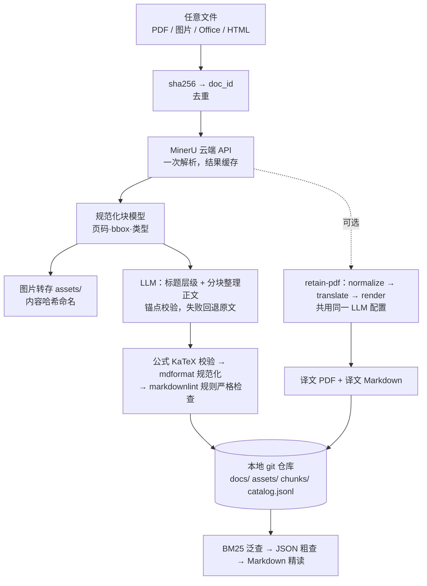

# pdf-skill

一个可以被各家 agent 调用的**文档库 skill**（Claude Code、Codex、Gemini CLI、Cursor、Copilot、OpenCode 等），包含两条工作流。

- **文件入库**：任意文件经 MinerU 云端 API 解析成 JSON，再由 LLM 分块整理成**严格、分层的 Markdown**。
  - 页码和坐标留在 JSON，文本放在 Markdown。
  - 图片保存到本地。
  - 所有内容扁平存放在一个 **git 仓库**里，用纯文本 BM25 检索。
  - 原件不保存。
- **PDF 原版翻译**：基于 [retain-pdf](https://github.com/wxyhgk/retain-pdf) 改造，保留原排版翻译成中文。
  - 翻译用的模型与入库共用同一份配置。
  - 译文 PDF 和译文 Markdown 同样入库、进索引。

English: an agent skill (any agent that follows the [Agent Skills](https://agentskills.io) spec) plus a CLI. It turns documents into strict hierarchical Markdown using MinerU and an LLM, keeps them in a flat git repository with BM25 search, and translates PDFs into Chinese with the layout preserved, using retain-pdf.



## 安装

需要 [uv](https://docs.astral.sh/uv/) 和 git。

```bash
uv tool install git+https://github.com/Uniseem/pdf-skill     # 安装 pdfskill 命令
pdfskill doctor                                              # 检查配置
pdfskill init                                                # 创建文档库（默认 ~/pdfskill-library）
pdfskill setup translate                                     # 可选：翻译环境（retain-pdf + typst + 字体，约 200 MB）
```

### 安装为 agent skill

skill 目录是 [`skills/pdf-skill`](skills/pdf-skill/SKILL.md)，它调用的就是上面装好的 `pdfskill` 命令。

| Agent | 安装方式 |
| --- | --- |
| 任意 agent（推荐） | `npx skills add Uniseem/pdf-skill --skill pdf-skill -g`：写入 `~/.agents/skills`，并在 `~/.claude/skills` 建符号链接 |
| GitHub CLI | `gh skill install Uniseem/pdf-skill pdf-skill --agent <claude-code\|codex\|gemini-cli\|cursor\|github-copilot\|opencode> --scope user` |
| Claude Code 插件 | `/plugin marketplace add Uniseem/pdf-skill`，然后 `/plugin install pdf-skill@pdf-skill` |
| Codex | `codex plugin marketplace add Uniseem/pdf-skill`，然后 `codex plugin install pdf-skill@pdf-skill` |
| Gemini CLI | `gemini skills install https://github.com/Uniseem/pdf-skill.git --path skills/pdf-skill` |
| 手动 | 把 `skills/pdf-skill` 复制到 `~/.agents/skills/`（Claude Code 用 `~/.claude/skills/`） |
| 不支持 skill 的 agent | 把 [docs/agents-md-snippet.md](docs/agents-md-snippet.md) 的内容贴进 `AGENTS.md` |

## 配置

密钥只从环境变量或用户配置文件 `~/.config/pdfskill/config.toml` 读取，**永远不会写进文档库**。`pdfskill config --init` 会生成一份带注释的模板。

| 用途 | 环境变量 | 说明 |
| --- | --- | --- |
| MinerU | `MINERU_TOKEN` | 在 <https://mineru.net/apiManage/token> 申请。没有 token 时自动改用匿名 v1 接口，限流较严 |
| LLM | `DEEPSEEK_API_KEY`、`DASHSCOPE_API_KEY`、`ZHIPUAI_API_KEY`、`MOONSHOT_API_KEY`、`SILICONFLOW_API_KEY`、`OPENROUTER_API_KEY`、`GEMINI_API_KEY`、`ARK_API_KEY`、`OPENAI_API_KEY`、`ANTHROPIC_API_KEY` 等 | 按 `pdfskill providers` 的列出顺序，取第一个在环境中找到的 key。内置 22 个服务预设 |
| 指定模型 | `PDFSKILL_LLM_PROVIDER`、`PDFSKILL_LLM_MODEL`、`PDFSKILL_LLM_BASE_URL`、`PDFSKILL_LLM_API_KEY` | `BASE_URL` 可以指向任意 OpenAI 兼容端点，包括 Ollama、vLLM、LM Studio 等本地服务 |
| 文档库位置 | `PDFSKILL_LIBRARY` | 也可以用 `--library` 指定；在含 `.pdfskill/` 的目录内运行时自动识别 |

没有配置 LLM 时仍可入库：标题层级靠编号规则推断，排版做确定性清理，输出同样通过严格校验。翻译必须配置 LLM。

## 用法

```bash
pdfskill ingest paper.pdf                  # 入库（自动 git commit）
pdfskill ingest ~/papers/ --tag survey     # 批量入库一个目录
pdfskill ingest scan.pdf --ocr --lang ch   # 扫描件
pdfskill translate paper.pdf               # 入库 + 原版翻译（简体中文）
pdfskill translate paper.pdf --render-mode dual   # 双语对照 PDF

pdfskill search "稀疏矩阵 speedup" -k 5     # BM25 泛查（中英混合）
pdfskill locate "Table 2"                  # JSON 粗查：页码、bbox、Markdown 行号
pdfskill outline 40ae                      # 标题树（id 前缀即可）
pdfskill get 40ae --pages 3                # 按页精读
pdfskill get 40ae --heading "Benchmarks"   # 按章节精读
pdfskill get 40ae6d1eeb06ed5d#0005         # 读检索命中的 chunk
pdfskill get 40ae --pages 3 --in zh        # 读译文
pdfskill list | show <doc> | remove <doc> | reindex [--rechunk]
```

所有命令都支持 `--json`：数据输出到 stdout，进度输出到 stderr。

## 文档库结构（扁平，git 友好）

```text
<library>/
├── catalog.jsonl            # 每篇文档一行，按 id 排序
├── docs/<id>.md             # 分层 Markdown：唯一 H1、标题不跳级、公式通过 KaTeX、GFM 表格
├── docs/<id>.json           # 页面尺寸、目录、块（类型/页码/bbox/预览/Markdown 行号）
├── docs/<id>.zh.md|.zh.pdf  # 译文
├── assets/<hash>.<ext>      # 图片，按内容哈希命名，跨文档自动去重
├── chunks/<id>[.zh].jsonl   # 检索分块（纯文本，逐行一条，可 diff）
└── .cache/                  # 已加入 .gitignore：BM25 索引、MinerU 原始结果、LLM 缓存
```

- `doc_id` 是原件 sha256 的前 16 位。原件本身不存，重复入库会被识别。
- BM25 索引不进 git，chunk 文件一变就自动重建。分词器不依赖词典：中文用单字加相邻两字（bigram），英文做 Snowball 词干。
- 查询路径：`search`（BM25 泛查）→ `locate`/`outline`（在 JSON 里粗查页码和位置）→ `get`（从 Markdown 取原文）。

## 严格 Markdown 是怎么保证的

1. **LLM 不碰表格、公式和图片**，这些由代码生成。表格从 HTML 转成 GFM，合并单元格会展开，单元格里公式的竖线会改写成 `\vert`。
2. LLM 只做两件事：
   - **定标题层级**：输出 JSON，经过 key 校验，并确保唯一 H1、不跳级。
   - **整理正文**：每段带 `[[b0012]]` 锚点。每段都要过一致性检查，归一化后的字符相似度 ≥ 88%，长度比在 0.8–1.2 之间，并且不允许出现标题、表格或 HTML。不合格的段落先重试一次，仍不合格就回退原文。
3. 所有公式用内置的 KaTeX 0.18.9 校验。不能渲染的公式先做廉价修正，再交给 LLM 单条修复，最后才降级为代码。
4. 用 mdformat（GFM + 严格 `$` 数学插件）规范化，并确认规范化前后渲染出的 HTML 一致、规范化结果幂等。
5. 用 pymarkdownlnt 按 markdownlint 规则集检查（MD013 行长除外），另外补查表格列数。

每篇文档的校验结果记在 `docs/<id>.json` 的 `conversion.validation` 里。

## 设计与复用

调研记录和取舍见 [docs/design.md](docs/design.md)。主要复用：

- [retain-pdf](https://github.com/wxyhgk/retain-pdf)（MIT）：翻译流水线，源码随本仓库分发，只修了打包问题。
- MinerU v4/v1 云端 API：客户端参考了 retain-pdf 和官方 SDK 的做法。
- 以下开源库：bm25s、PyStemmer、openai SDK、mdformat、markdown-it-py、pymarkdownlnt、KaTeX（经 dukpy 运行）、rapidfuzz、json-repair。
- 设计思路来源：
  - MinerU `llm_aided` 标题分级
  - marker `--use_llm`
  - mineru-refine 的一致性闸门
  - qmd 和 claude-obsidian 的检索输出格式

## 限制

- retain-pdf 只支持**翻译成简体中文**，且只能翻译 PDF 输入。
- MinerU 单个文件不超过 200 页、200 MB。更长的文档用 `--pages` 分段入库。
- 译文 PDF 会直接提交进 git，默认把图片压到 150 dpi，用 `--compress-dpi` 调整。
- 翻译环境里的 PyMuPDF 是 AGPL 许可，详见 [THIRD_PARTY_NOTICES.md](THIRD_PARTY_NOTICES.md)。

## 开发

```bash
uv sync
uv run pytest            # 离线测试：MinerU 请求用 httpx MockTransport，LLM 用 tests/mock_llm.py
uv run ruff check src tests
uvx --from skills-ref==0.1.1 agentskills validate skills/pdf-skill
```

`skills/pdf-skill/SKILL.md` 的正文必须与 `src/pdfskill/guide.md` 保持一致，由测试检查。

## 许可证

MIT。第三方组件的许可见 [THIRD_PARTY_NOTICES.md](THIRD_PARTY_NOTICES.md)。
