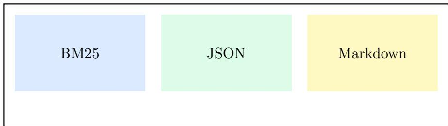

# Flat Document Libraries for Agents

Ada Example · Lin Placeholder

Abstract. We describe a flat, git-friendly layout for storing parsed documents. Every document is converted into hierarchical Markdown, while page-level geometry is kept in JSON. Retrieval uses plain BM25 over text chunks, so the whole library can be versioned, difed and merged like source code.

## 1 Introduction

Agents increasingly need to read large collections of papers, manuals and scanned books. Storing each document as a directory tree quickly becomes hard to navigate, and binary vector indexes do not merge cleanly in version control. We therefore keep one Markdown file and one JSON file per document, both named by a content hash. Lorem ipsum dolor sit amet, consectetur adipiscing elit, sed do eiusmod tempor incididunt ut labore et dolore magnam aliquam quaerat voluptatem. Ut enim aeque doleamus animo, cum corpore dolemus, fieri tamen permagna accessio potest, si aliquod aeternum et infinitum impendere malum nobis opinemur. Quod idem licet transferre in voluptatem, ut postea variari voluptas distinguique possit, augeri amplificarique non possit. At etiam Athenis, ut e patre audiebam facete et urbane Stoicos irridente, statua est in quo a nobis philosophia defensa et collaudata est, cum id, quod maxime placeat, facere possimus, omnis voluptas assumenda est, omnis dolor repellendus. Temporibus autem quibusdam et aut oficiis debitis aut rerum necessitatibus saepe eveniet, ut et voluptates repudiandae sint et molestiae non recusandae. Itaque earum rerum defuturum, quas natura non depravata desiderat. Et quem ad me accedis, saluto: 'chaere,' inquam, 'Tite!' lictores, turma omnis chorusque: 'chaere, Tite!' hinc hostis mi Albucius, hinc inimicus. Sed iure Mucius. Ego autem mirari satis non queo unde hoc sit tam insolens domesticarum rerum fastidium. Non est omnino hic docendi locus.

## 1.1 Notation

Let $D = \{ d _ { 1 } , . . . , d _ { n } \}$ be the set of documents and let � be a query. The BM25 score of a document is

$$
\operatorname{score} (d, q) = \sum_ {t \in q} \operatorname{IDF} (t) \cdot \frac {f (t , d) \cdot \left(k _ {1} + 1\right)}{f (t , d) + k _ {1} \cdot \left(1 - b + b \cdot \frac {| d |}{\operatorname{avgdl}}\right)}\tag{1}
$$

where $f ( t , d )$ is the term frequency and $k _ { 1 } = 1 . 5 , ~ b = 0 . 7 5$ are the usual constants. Equation Equation 1 is evaluated over chunks rather than whole documents.

## 1.2 Design goals

The layout must satisfy three goals: it must be flat, it must be text-first, and it must preserve page numbers for citation.

## 2 Method

2.1 Storage layout

<table><tr><td>Path</td><td>Content</td><td>In git</td></tr><tr><td>docs/.md</td><td>Hierarchical Markdown</td><td>yes</td></tr><tr><td>docs/.json</td><td>Page geometry and anchors</td><td>yes</td></tr><tr><td>assets/.png</td><td>Extracted images</td><td>yes</td></tr></table>

Table 1: Files written for each document.

## 2.2 Retrieval pipeline

  
Figure 1: Coarse-to-fine retrieval: BM25, then JSON anchors, then Markdown.  
A query first retrieves candidate chunks with BM25, then resolves page numbers through the JSON file, and finally reads the exact section from Markdown.

## 3 中文说明

本节用于测试中文内容的解析与检索。扁平化存储意味着所有文档都放在同一层目录中，依靠索引文件进行查询。对于公式 $E = m c ^ { 2 }$ ，解析结果应当保留为行内公式。检索时先用 BM25 泛查，再用JSON 定位页码，最后从 Markdown 中读取细节。

## 4 Conclusion

Keeping text and geometry separate makes both easy to maintain. Lorem ipsum dolor sit amet, consectetur adipiscing elit, sed do eiusmod tempor incididunt ut labore et dolore magnam aliquam quaerat voluptatem. Ut enim aeque doleamus animo, cum corpore dolemus, fieri tamen permagna accessio potest, si aliquod aeternum et infinitum impendere malum nobis opinemur. Quod idem licet transferre in voluptatem, ut postea variari voluptas distinguique possit, augeri amplificarique non possit. At.

## References

1. S. Robertson and H. Zaragoza. The probabilistic relevance framework: BM25 and beyond. 2009. 2. Example Authors. Parsing documents with layout models. 2024.